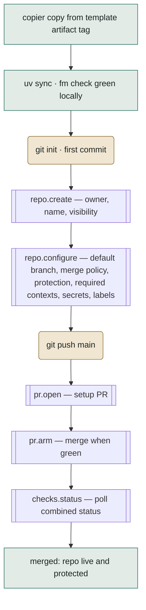
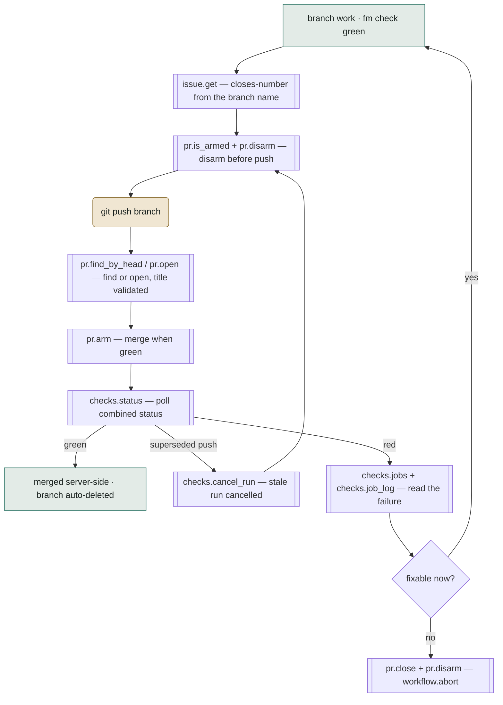
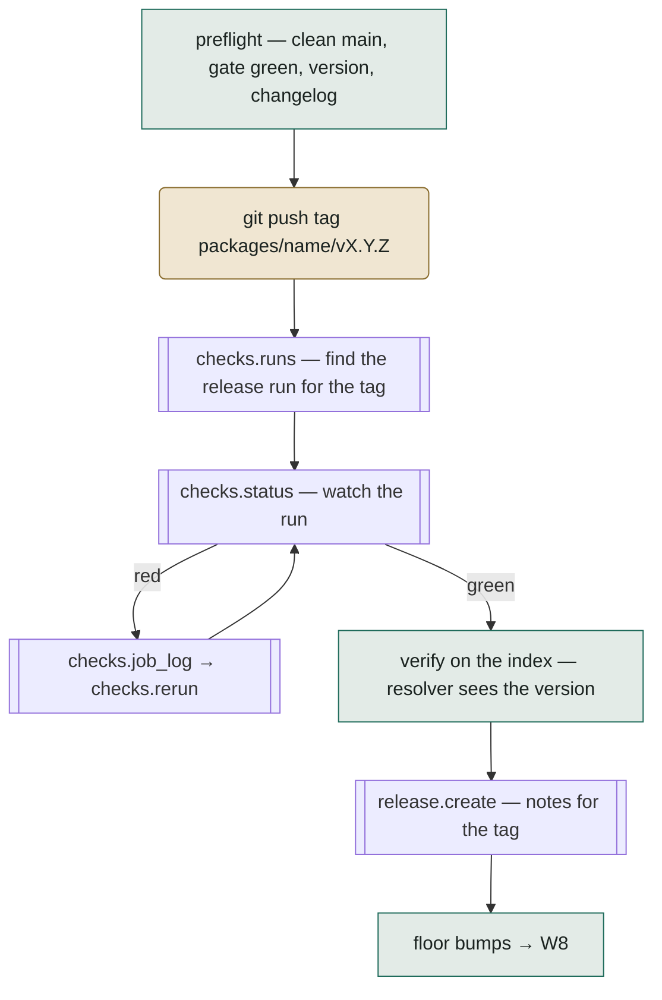

# Development workflows

Status: design input, drafted 2026-08-30 — the fitness yardstick for
the forge protocol (bootstrap phase 1) and a design input to the
workshop. 2026-08-31: verb spellings updated to the drafted protocol
(`pr.is_armed`, `checks.jobs`, `checks.rerun` with `failed_only`,
labels folded into `repo.configure`, `repo.delete_branch` added);
`packages/forge/docs/protocol.md` is now the authoritative surface.

Willem's ask, verbatim in intent: the forge protocol's fitness for
purpose cannot be judged without an exhaustive chart of the development
workflows it must carry, ideally with the mapping onto the interface —
and the same chart is a design input into the workshop, because the
workshop's verbs *are* these workflows. This note is that chart. The
verb names are the draft the bootstrap plan's phase 1 refines; the
workflows are the stable part, mined from hse's shipped devkit (the
`gitea.py` call surface, `ship.py`, `repo.py`, `workflow.py`,
`template.py`, `_fleet.py`) and from the workshop plan's lifecycle
sections.

## How to read it, and how to judge with it

Every step in every workflow runs in one of three lanes:

- **local** — filesystem, uv, footman tasks, copier renders. Never
  touches the network.
- **git** — clone, fetch, push, tags. Goes over git transport with a
  token, but never through the forge's REST/GraphQL API.
- **forge** — the only lane `livery.forge` owns. Every touch in this
  lane is labelled with its draft protocol verb.

Fitness is then checkable in both directions:

1. **Coverage.** Every forge-lane touch in every workflow resolves to
   exactly one protocol verb. A touch with no verb is a hole in the
   protocol.
2. **Necessity.** Every protocol verb is touched by at least one
   workflow. A verb no workflow needs is cut — the protocol carries no
   speculative surface.
3. **Capability honesty.** Every per-forge divergence in the mapping
   table is either normalised away by the backend or declared as a
   named capability probe — never papered over.
4. **Lane discipline.** Nothing in the git lane secretly needs the API
   and nothing in the forge lane could have been a git operation. The
   split is what keeps the protocol small.

In the diagrams: rectangles are local, rounded are git, double-walled (subroutine) are forge, the verb named before the em dash.

## The families

| Family | Workflows | Workshop owner |
| --- | --- | --- |
| Birth | W1 project birth · W2 package birth | `fm create.project` / `create.package` / `create.repo` |
| The inner loop | W3 ship · W4 CI triage | `fm ship` · `fm ci.*` |
| The release train | W5 package release · W6 template snapshot | `fm workflow.release` · workshop publication |
| The update wave | W7 instance update · W8 floor bumps | `fm update` · release aftermath |
| Operations | W9 fleet · W10 issue-driven work · W11 nightly · W12 doctor | `fm fleet.*` · `fm status` · scheduled CI · `fm doctor` |

## Birth

### W1 — project birth

A stranger (or the studio) goes from nothing to a protected, CI-green
repository. hse provenance: `create.project` + `create.repo`
(`repo.py`: `create_repo`, `configure_repo`, `_set_main_branch_protection`,
`_set_squash_merge`, `_bootstrap_kind_labels`, `_open_setup_pr`).

The template fetch itself is the git lane (the artifact repository is
cloned by copier at a tag) — the forge API is not involved until the
new repository must exist and be configured. Trusted publishing
registration (PyPI ↔ GitHub/GitLab) is out-of-band on the index side;
the forge only stores the token secret where tokens are the mechanism
(Gitea → devpi).

### W2 — package birth inside a monorepo

`fm create.package`: render the package template into `packages/`,
wire the workspace member, floors, and layering lint. **Zero forge
touches.** It appears in this note precisely to prove the lane
discipline — a workflow the protocol must not grow a verb for. The
repository the package lives in already exists; its first release is
W5.

## The inner loop

### W3 — ship

The centrepiece: hse's `ship_flow`, run tens of times a day by agents.
Provenance: `_resolve_closes` (issue link from branch name),
`_disarm_before_push`, `_abort_if_merged`, `_push_and_pr`,
`_merge_title` validation, the arming ladder.

Notes the protocol must honour: disarm-before-push is ordering-critical
(hse's forge evidence: pushing to an armed PR can merge a stale head);
merge happens server-side, so the loop's exit is *observed*, never
performed (`_abort_if_merged` guards the race); the superseded-push
branch is where `cancel_run` earns its first-class seat — today hse
leaks those runner-minutes.

### W4 — CI triage

`fm ci.rerun` today: a red run on a branch or main → `checks.runs`
(list for ref) → `checks.jobs` → `checks.job_log` →
`checks.rerun` (failed jobs by default) or fix-forward; a wedged or storming queue →
`checks.cancel_run` (forced when the runner stopped answering — Gitea
1.28's `force-cancel`, GitHub's `force-cancel`; GitLab declines
`force` by name). Evidence lands in the PR or an issue via `*.comment`.

## The release train

### W5 — package release

`fm workflow.release` (with hidden `build` / `publish` /
`configure-repo` steps): version determined from tags and changelog
locally, then the forge carries the run.

Re-running the verb *is* the recovery procedure (process rule 4), so
every step probes before acting: tag exists (`repo.tags` or git),
release exists (`release.get` by tag), run state (`checks.runs`). The
index verification is its own lane (the resolver, `published.py`
style), not a forge call. `configure-repo` re-asserts repository
settings — `repo.configure` is idempotent drift-repair, the same verb
W1 used.

### W6 — template snapshot publication

The workshop's own release aftermath: render the template snapshot
locally → `repo.get / repo.create` to ensure the artifact repository →
git push commit + tag `vX.Y.Z` (lockstep with
`packages/workshop/vX.Y.Z`) → refuse same-version-different-content by
comparing trees (git lane). Almost entirely local + git; the forge
contributes existence and protection only. Idempotent by construction.

## The update wave

### W7 — instance update

`fm update` on any instance (a stranger's project, hse, the monorepo's
own render gate): read the latest template release (`repo.tags` on the
artifact repository — a forge read, since "latest release" is a tag
listing) → `copier update` locally → then simply **W3** with the update
branch. A conflict leaves the PR unarmed with the evidence in
`pr.comment` — never a silent forced merge.

### W8 — floor bumps

Release of package X in the monorepo → affected graph (local) → bump
branches per dependent → **W3** per branch. Nothing new in the forge
lane; the wave is W3 at fan-out, which is why W3's verbs must be safe
under concurrency (arming several PRs whose runs share a queue — and
`cancel_run` when the wave supersedes itself).

## Operations

- **W9 — fleet.** hse's `_fleet.py` enumerates from *configuration*,
  not from an org-listing call — and this note keeps it that way: no
  workflow demands a `repo.list_org` verb, so necessity says it stays
  out until one does. Per repository, fleet work is W7/W3/W4 fanned
  out, plus `checks.dispatch` to wake workflows and `checks.cancel_run`
  to withdraw a storm.
- **W10 — issue-driven work.** `issue.assigned_to_me` → `issue.get` — title, full body, labels; the body *is* the work order — → branch named for the issue → W3 with the closes-link →
  `issue.comment` for evidence the PR body can't carry → close happens
  by merge keyword, not by API.
- **W11 — nightly.** The scheduled released-wheels replay (hermetic:
  the wheel from the index against its own recorded cassettes) → on
  failure `issue.create` with the evidence attached; the live forge
  legs run per release instead, where their verdict changes a
  decision. The nightly is the only workflow that *creates* issues
  unprompted, so its dedup probe (`issue.search` by marker text
  before create) is part of the workflow, not left to chance.
- **W12 — doctor / identity.** `identity.whoami`, token-for-host
  precedence (`is_configured_host`), `identity.server_version` (the
  1.28 floor probe), `forge.supports(...)` report. Runs at the start of
  anything unattended; a wrong-host token dies here, not mid-wave.

## The mapping table — draft verbs to the three forges

The draft the bootstrap plan's phase 1 refines. **Bold** marks a named
capability probe; the GitLab column is the odd-one-out check in action.

| Verb | Used by | GitHub | Gitea (≥1.28) | GitLab |
| --- | --- | --- | --- | --- |
| `repo.create` / `repo.get` / `repo.delete` | W1 W6 | REST repos | REST repos (hse-proven) | projects API; **owner may be a group path** |
| `repo.configure` (default branch, merge policy, protection, required contexts, secrets, variables, labels, Pages) | W1 W5 | REST branch protection + actions secrets | hse-proven end to end | protected branches + **approval rules are tier-gated** |
| `repo.tags` | W5 W7 | REST tags | `list_tag_names` (hse-proven) | tags API |
| `repo.branch_exists` / `repo.delete_branch` | W1 W3 (the abort exit's cleanup) | branches API | branches API (exists hse-proven) | branches API |
| `pr.open` / `pr.find_by_head` / `pr.find_by_head_sha` / `pr.get` / `pr.close` / `pr.reopen` / `pr.update_title` | W1 W3 W7 W8 | pulls API | hse-proven | MRs; **iid vs global id** — the protocol speaks one handle |
| `pr.merge_now` | W3 (manual override) | merge API | `merge_pr_now` (hse-proven) | accept MR |
| `pr.arm` / `pr.disarm` / `pr.is_armed` | W1 W3 W7 W8 | GraphQL enable auto-merge; needs protection | schedule merge-when-checks-succeed (hse forge evidence) | merge-when-pipeline-succeeds; **auto-merge strategy differs by tier** |
| `pr.comment` | W4 W7 W10 | issues comments API | issue comments API | MR notes API |
| `checks.status` (combined, for a sha) | W1 W3 W5 | combined status + check runs behind one answer | `commit_combined_status` (hse-proven) | **pipeline status is the canonical answer, not commit status** |
| `checks.runs` / `checks.jobs` / `checks.job_log` | W3 W4 W5 | actions runs API | actions runs API (hse-proven) | pipelines + jobs + job trace |
| `checks.rerun` (`failed_only=True` by default) | W4 W5 | rerun APIs | `rerun_run` (hse-proven) | pipeline retry |
| `checks.cancel_run(run, *, force=False)` | W3 W4 W9 | cancel + force-cancel | cancel + force-cancel (1.28, documented) | pipeline cancel; **declines `force` by name** |
| `checks.dispatch` | W9 W11 | workflow dispatch | `dispatch_workflow` (hse-proven) | pipeline trigger / run |
| `release.create` / `release.get` | W5 W6 | releases API | `create_release` (hse-proven) + get by tag | releases API |
| `issue.create` (title, body, labels, assignee) / `issue.get` (with body) / `issue.list` / `issue.search` (text query) / `issue.assign` / `issue.assigned_to_me` / `issue.comment` | W3 W10 W11 | issues + search API | issues + repo issue search; hse's thinner surface (no body on create, no text query) ruled not good enough | issues + search scope; **group-level boards are out of protocol** |
| `identity.whoami` / `identity.server_version` | W12 all-unattended | `/user` + API version | `whoami` (hse-proven) + `/version` | `/user` + `/version` |
| `forge.supports(capability)` | everywhere a bold cell exists | — | — | — |

## Gaps this note surfaced

The chart already paid rent — these are absent from hse's shipped
inventory but demanded by the workflows above, so they enter the phase
1 draft on coverage grounds:

1. **`pr.comment` / `issue.comment`** — W7's conflict evidence and
   W11's failure evidence need a comment verb; `gitea.py` never grew
   one because hse posts evidence into PR bodies it authors.
2. **`release.get` by tag** — W5's re-run probe ("does the release
   already exist?") has no hse call; today re-running would re-create.
3. **Branch deletion after `workflow.abort`** — merge-path deletion is
   repo configuration (delete-on-merge), but the abort path (W3's
   "no" exit) currently strands the remote branch.
4. **Issue text, both ways** — Willem's ruling, 2026-08-30: the
   inherited interface can neither provide body text when creating an
   issue nor query issue text. `issue.create` carries title, body,
   labels, and assignee; `issue.get` returns the body; and
   `issue.search(text)` joins the draft — W10's work orders and W11's
   dedup probe both depend on it.

And one cut on necessity grounds: **no `repo.list_org`** — fleet
enumeration stays configuration-driven (W9) until a workflow actually
demands discovery.

## What the workshop takes from this

- The workshop is the *orchestration* of the lanes: every `fm` verb
  above is a composition of local, git, and forge steps in a stated
  order, and raw forge verbs never reach a user's hands.
- W3 is the unit of reuse — W1, W7, and W8 all end by *becoming* W3.
  Ship must therefore be a callable flow, not a CLI entry point with a
  loop inside.
- Recovery is re-entry: every workflow resumes by re-running its verb,
  which is why each forge touch above is probe-before-act. The
  conformance suite tests each workflow's *second* run as seriously as
  its first.
- Polling, not webhooks, is the v1 observation model everywhere
  (`checks.status` loops) — a deliberate never-foreclose: webhooks are
  an optimisation a later version may add without changing any
  workflow's shape.

## Open

1. Review workflows (requesting reviewers, approvals) — absent from
   hse's solo/agent model; needed before any team adopts the workshop?
2. `repo.archive` for project retirement — no workflow demands it yet.
3. Should W11's evidence attach as release/run artifacts rather than
   issue text on forges that support it?
4. Where does this note live long-term — spec/livery beside the
   protocol, once phase 1 freezes the verb names?
