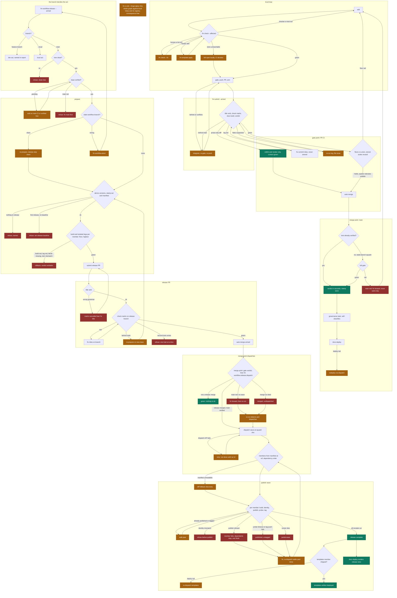

# CI and quality gating: the plan

Status: ruled 2026-09-07, every open ruling closed in review.
Phase 1's substrate landed 2026-09-07 (issue #289): the loop is
whole, gate to receipt; the evidence lives in the phase's
acceptance bullet, and the one open line there names what rides
the wheels-matrix work instead.
Phase 2 landed 2026-09-09 in three slices: the profile mount and
the profiled legs with their trace artifacts (issue #314), the CI
state store on `refs/workshop/*` (issue #317), and the metrics rows
with `fm ci.timings` (issue #319, the pull-request lookup fixed in
#321). Phase 3 began the same day: the points shell (issue #322),
the merge-point release dispatch (issue #325), the nightly point
with the schedule seam's first entry (issue #327), the matrices as
contract config (issue #329), the kebab-case keys with the one
contract loader (issue #331), and the wheels matrix with the loop's
nanobind member (issue #335) landed on the gitea emitter: phase 3
is complete. Phase 4 began the same day with affected mode in the
check legs behind `[ci] affected-legs` (issue #338) and the
verified-tree record that lets main's run skip a tree its pull
request already proved (issue #340), and the coverage union on the
gitea lane, judging only the packages the legs' scopes covered,
with `fm ci.e2e` proving its three shapes from the runs' logs
(issue #342, first step) and the per-suite coverage store that
lets a narrowed leg skip a suite and the gate reuse its lines
(issue #345), and the gate point's shell reached the GitHub lane
with livery's own pull requests narrowed (issues #352, #353). The
entry-points race (#263) has its root cause and fix (the completion
test healing the real project's environment mid-suite; the dev
build leaving editables stale).
Absorbs #267 (the speed pass), #286 (no logic in YAML), #270 (token
publishing), #273 (the act names itself), and the structural finding of
the phase-4 post-mortem (notes/20260906-phase-4-post-mortem.md): the
workspace world was fully verified, the release world barely, and the
gap is where every release-day defect lived.

Willem's requests shaping it (2026-09-07): a local CI mode, one
platform, against Gitea and GitLab with a local devpi server, Gitea
first and GitLab once Gitea is in a good state, with token publishing
provisioned on the local Gitea. A minimal number of workflows.
Generalise hse's profile-based CI instrumentation, across CI
invocations. Plus everything distilled from the release day.

## Part 1: the current state

Everything below was read from the code and measured from real runs on
2026-09-06/07. File references are to HEAD (7a0c671).

### The workflow files

Six files under `.github/workflows/`, four emitted, two written by
hand:

| file | origin | triggers | jobs |
| --- | --- | --- | --- |
| ci.yml | emitted | pull_request, push main | release-title, check (3 OS x 2 py), docs, gate |
| release.yml | emitted | pull_request closed on main, dispatch(ref) | publish, templates |
| docs.yml | emitted | workflow_run on ci@main, dispatch | deploy (Pages) |
| governance.yml | emitted | push main, paths-filtered | apply (fm workflow.configure) |
| nightly.yml | by hand | cron 04:17, dispatch | released-wheels-replay (6 legs), file-issue-on-failure |
| release-legs.yml | by hand | dispatch | gitea-local, gitlab-local, 3 cloud legs, coverage-report |

The emitter is `packages/workshop/src/livery/workshop/_ci_generate.py`,
one backend per call, rendered only at `template.apply` / the update
wave / repository birth, never per release. The drift gate
(`template_check`, inside `fm check`) holds the four emitted files
byte-identical to the emitter. The two hand-written files sit outside
that gate and each carries a hand-pinned uv version with a comment
admitting the emitted files derive the same value from `uv.lock`: a
lock bump desynchronises them silently.

That rot is not hypothetical: release-legs.yml is inert today
(found 2026-09-07, livery#287). The suites read `FORGE_LIVE` and
`FORGE_E2E_OWNER`; the workflow still exports the pre-rename
`LIVERY_FORGE_*` names, and its cloud legs write credentials to the
retired `.forge.dev.env` path nothing reads. A dispatch goes green by
replaying cassettes and prints a "Live coverage union" containing no
live execution. The file decayed exactly where the drift gate does
not look.

Run entries per merged PR today: ci on the PR, ci again on main, docs
via workflow_run, and a release run that exists only to skip (its
train_if rejects non-release merges in 1-2 seconds). Five entries, two
heavy.

### Where the time goes, measured

A ci run costs 13 to 16 minutes wall. One representative main run
(34061689914):

| job | seconds |
| --- | --- |
| check windows-latest 3.11 | 793 |
| check ubuntu-latest 3.11 | 461 |
| check windows-latest 3.14 | 454 |
| check macos-latest 3.14 | 331 |
| check ubuntu-latest 3.14 | 165 |
| docs (after check) | 133 |
| gate | 16 |

Inside the Windows 3.11 leg: checkout 7s, setup-uv 15s, enter 7s, the
gate itself 754s. Runner setup is noise; the time is `fm check` on
Windows. The same gate on ubuntu 3.14 is about 130s, which matches a
local worktree run (2m08s). Nobody knows where the Windows 620-second
difference goes, because no leg is instrumented.

### What one change pays

- `fm submit` runs the full gate locally, then CI runs it on six legs,
  then the merge runs it on six legs again on main. A self-heal
  (conflict or behind) re-runs the local gate per heal.
- A release adds: the wait for main's own CI to verdict the base
  (`require_verified_base`), two isolated legs per member (floor and
  highest), the full local gate inside the release submit, six CI legs
  on the release PR, then the publish wave.
- A notes-only diff pays all of it. `affected_packages`
  (`_graph.py:48-80`) returns None, meaning everything, when any
  changed file falls outside every package, and `notes/` is outside
  every package. The affected seam cannot express a prose change
  today.

### The gate's composition

`fm check` (`_quality.py:139-191`) is one `parallel()` block: format,
lint, typecheck (six invocations: basedpyright, three platform mypy
passes, ty, pyrefly), typecomplete, tests, kindcheck, the render/drift
gate, the provenance gate. `--fix` serialises the three rewriters
first.

The affected seam already exists and is real: `fm check --affected`
computes the dependents closure and scopes format, lint,
basedpyright/mypy paths, typecomplete, and test dirs. Deliberate
limits: ty and pyrefly always run whole, and scoped mode skips the
render gate. CI does not use it anywhere.

### The emitters, by backend

The GitHub lane is the mature one. The Gitea lane diverges: no
workflow_dispatch recovery entry on its release workflow, unpinned
`actions/checkout@v4`, no coverage metering or artifact, and its
templates job lacks the `contains()` guard the GitHub one has, so the
template artifact would publish on every release wave. The GitLab lane
collapses to one python with no OS matrix, ignores `[ci] runners`, and
triggers its release wave on a commit-title regex instead of the
merged branch.

Dead code: the wheels matrix (`_wants_wheel_matrix`,
`_ci_generate.py:317-331`) reads `answers["packages"]`, a key
`_facts()` never emits, so no real generation ever produces the wheels
job; only synthetic test dicts reach it. A platform-wheel member would
silently get a wheel-less release today.

Decision expressions in the emitted YAML: the census is in #286. Five
are movable into verbs; the one defensible survivor is the event
filter class (which branch, which event).

### The local forge stack

Further along than assumed. `fm forge.dev.up` (packages/forge,
`_dev/`) brings up a digest-pinned Gitea 1.28 with Actions enabled and
an act_runner in host mode (labels ubuntu-latest, capacity 8), and a
GitLab CE with a registered shell-executor gitlab-runner (concurrency
8). Seeding mints the admin user, an all-scope token, the `livery`
org/group, and runner tokens, and writes credentials key-by-key to
`.repo.shared.env` in the runner's config directory. No repositories
are seeded; suites make their own. Housekeeping fault: compose.yaml
and two docstrings still name the retired `.forge.dev.env` path.

`release-legs.yml` already drives release legs against these local
containers from CI, by hand, dispatch-only.

### Publishing and registries

`publish_wheels` (`_publish.py:253-280`) already speaks
`uv publish --publish-url <url> --token <token>`; the token is
`os.environ.get("UV_PUBLISH_TOKEN")` at both call sites. The GitHub
lane overrides this with trusted publishing (environment `pypi`,
id-token); the Gitea lane already emits `UV_PUBLISH_TOKEN` from
secrets, with the comment "Gitea has no trusted publishing".

Registry resolution (`_registries.py:76-125`) is a ladder: env cascade
(`PYTHON_REGISTRY_URL` / `PYTHON_PUBLISH_INDEX`), then `[registries]`
in workshop.toml, then the forge's own package registry, then
pypi.org. But the isolated legs read a different surface entirely:
`[[tool.uv.index]]` from the root pyproject (`_index_args`,
`_python.py:368-385`). One private index today means configuring two
places. And the wave's served-probe builds `SimpleRegistry` without a
token (`_release_driver.py:738`) although the class accepts one, so an
authenticated index would probe anonymously and time out.

Secrets: `fm env.set KEY --scope=ci` writes repository Actions secrets
through the forge protocol on all three backends (GitHub via the
PyNaCl extra, Gitea plaintext PUT, GitLab masked variables). The
provisioning verb for a local publish token already exists.

devpi appears nowhere in source or config, only in notes; hse runs one
externally.

### Instrumentation today

Every duration on screen is footman's report (per-task line, `took
XmYYs`); workshop adds none of its own. footman persists exactly one
number per invocation shape, the wall total, in a machine-local
`.times.json` that is cold on every CI leg. `fm --json` already emits
per-task duration, queue wait, lane waits, sections, and per-step
timings; nothing consumes it.

`footman.profile` is a complete plugin: `--profile` writes a Chrome
trace with a track per worker, a slice per task, steps, lane waits,
author sections/marks/streams (including retroactive spans built for
CI check windows), and per-test slices via the `FM_PROFILE_DIR`
fragment protocol that footman's pytest plugin speaks natively. livery
does not mount it, so `fm --profile check` does not work here today.

hse mounts it fleet-wide and uploads one trace artifact per profiled
leg (via the gitea fork of upload-artifact, with `if-no-files-found:
ignore`, both learned the hard way). Across runs hse aggregates
nothing: no download, no merge verb, no store. What hse does have,
built for other metrics and directly reusable, is the stamp transport
(`hse-devkit/_stamp.py`): a JSON file on an ordinary git ref, written
from inside a CI job without a worktree via hash-object/mktree/
commit-tree/force-push, commits carrying `[skip ci]` and their own
identity. Its two consumers (e2e freshness, coverage high-water mark)
encode the rules a cross-run store needs: only the gated run class
writes, absent data is not regression, fail open loudly, and never
rewrite the file from a state you could not read.

## Part 2: the improvements

### The rulings this plan builds on

- No logic in YAML if it can be avoided; it all lives in tasks
  (Willem, 2026-09-06, #286).
- Token-based publishing suits monorepos better than trusted
  publishing (Willem, 2026-09-06, #270).
- Local CI mode against Gitea and GitLab; Gitea first, GitLab once
  Gitea is in a good state (Willem, 2026-09-07). The request named
  a local devpi; superseded the same day by the forge's own
  registry (decision record).
- A minimal number of workflows (Willem, 2026-09-07).
- Measure the loop end to end and attack the biggest waits first
  (Willem, 2026-09-06, #267).
- Enforced serial legs are not a win; explicit parallelism is the
  shape (Willem, 2026-09-06).
- Develop locally: nothing reaches GitHub until tested exhaustively
  on local Gitea and GitLab; the only public iterations hunt
  GitHub's own quirks; Gitea first, because a clean environment is
  cheapest to stand up there (Willem, 2026-09-07).
- Matrices are parametrised through the contract: the development
  workspaces run python 3.14 on linux only, with docs generation
  stubbed, and the keys are ordinary workshop.toml config with
  derived defaults (Willem, 2026-09-07).

### Phase order, and why

Ruled by Willem 2026-09-07: develop as locally as possible. Nothing
reaches GitHub until it has been tested exhaustively on the local
forges, and the only public iterations are the ones that hunt
GitHub's own quirks.

1. The local Gitea loop: the development substrate for everything
   after. Gitea only, because a clean environment is cheapest to
   stand up there.
2. Instrument the loop, inside it.
3. The new shape, on the Gitea emitter only, so the flux is never
   ported three times.
4. The speed mechanics, proven in the same loop.
5. GitLab reaches the same state, still locally.
6. The GitHub port: livery flips, the quirks are hunted, the live
   numbers are attacked.

Each phase lands gate-green and mergeable alone, per the working
conventions.

### Phase 1: the local Gitea loop, the development substrate

Everything later in this plan is developed inside this loop, ruled
by Willem 2026-09-07: nothing reaches GitHub until it has been
tested exhaustively on the local forges, and the only public
iterations are phase 6's GitHub quirk hunt. Gitea only to begin
with: it is the cheapest environment to stand up cleanly, and
iterating on one backend while the shape is still moving avoids
paying to keep three aligned.

The post-mortem's structural fix. The release act, on real emitted
YAML, on a real runner, against a real index, from one command.

- No devpi (ruled by Willem 2026-09-07). The loop publishes to the
  local Gitea's own package registry through the ladder's forge
  rung, which already resolves it: the Gitea backend's
  `registry_url("python", owner)` returns
  `{host}/api/packages/{owner}/pypi` today. No new container, no
  new credential class, and a shipped rung that was an untested
  fallback becomes exercised code. The passthrough task either index
  was assumed to force is measured unnecessary: Gitea validates the
  token and ignores the basic-auth username, so uv's plain
  `--token` form uploads as-is. A probe wheel published and read
  back proved the circle.
- The loop's CI is linux-only for now (ruled by Willem 2026-09-07):
  the containered act_runner is the whole runner fleet. Linux wheel
  legs run in the loop against the dummy platform-wheel member; a
  macos or native runner waits for a real platform-wheel member
  that needs those platforms.
- Publishing is a kind seam (ruled by Willem 2026-09-07, landed
  2026-09-07): `publish_artifact` is a `Backend` protocol member
  and the wave dispatches through it, picking only the resolved
  target for the kind's artifact. `uv publish` is the python kind's
  implementation (the nanobind kind delegates to it), and the conan
  kind wraps its recipe upload. A future kind brings its own
  publisher and registry rung without the wave changing shape.
- One index seam, broadened by Willem 2026-09-07: the contract
  expresses the registry topology, and the render emits it. The
  first slice landed 2026-09-07 and the loop proves it every pass:
  `[registries.python]` (`url`, plus `prerelease` carrying uv's
  policy value) renders into the root pyproject as the
  `[[tool.uv.index]]` entry and the `[tool.uv]` prerelease line,
  through `registry_injections` beside the other contract-fed
  render inputs, so a re-render can never unwire the index again.
  The loop measured the unwire live twice: birth's resume
  re-rendered pyproject and the e2e's surgery re-applied, two
  commits per run; then a member render (`new.package` re-renders
  the roster) stripped the wiring after the surgery had already
  passed, and the next lock silently resolved the workshop back to
  the released PyPI index. Two resolution facts the loop forced,
  both load-bearing: uv's first-index strategy resolves a package
  served by the declared index from that index alone, and no
  prerelease mode is declared, uv's default ruling (the decision
  record's prerelease entry carries the ruling and the
  measurements). Still open in this seam:
  reads as an ordered list (hse's caching mirror with a private
  overlay), rendering `publish`, and per-platform index pins (the
  pytorch case); what the contract cannot say still needs a durable
  seam in the rendered pyproject rather than a hand edit the next
  render reverts. The isolated legs' `[[tool.uv.index]]` surface
  and `resolve_registry` read one declaration. The served-probe
  carries the token `SimpleRegistry` already accepts, which the
  authenticated local registry forced immediately.
- Provisioning: a verb births (or reuses, idempotently) the repo on
  the seeded Gitea org, pushes HEAD, asserts protection and context,
  and writes `UV_PUBLISH_TOKEN` (the registry credential) and the forge
  token as Actions secrets through the existing
  `RepoConfig.secrets` path. This is the "token based publishing
  provisioned on the local gitea instance" requirement.
- The rehearsal verb (working name `fm ci.e2e`,
  `--forge=gitea` first): run the real workflows on the local
  instance through act_runner, the release act publishing to the
  local registry,
  receipt tags on the local repo, verdicts followed, idempotent
  re-run as the recovery procedure. Absorbs what release-legs.yml
  did by hand.
- Gitea emitter parity while it is finally exercised: the dispatch
  recovery entry, pinned checkout, the templates `contains` guard
  moved into its verb (phase 3 shape), and an explicit decision on
  coverage metering for that lane. Two parity findings already
  measured and fixed on first contact (2026-09-07): Gitea reports
  Actions statuses as `<workflow> / <job> (<event>)`, so a bare
  required context could never match and no protected merge could
  ever pass; `required_context_string` now spells protection per
  forge, pinned. And the emitted gitea governance job carries no
  ambient-token env, so `workflow.configure` refused in-workflow;
  the loop provisions `FORGE_ADMIN_TOKEN` and the emitter gap is
  phase-3 work. Also measured: the emitted-workflows-versus-
  installed-workshop version skew fails exactly as predicted (the
  docs job's "no task named"), and eating the dev wheels cures it;
  the full gate on the loop's fixture-scale workspace runs in 4 to
  6 seconds inside the container. And a third parity finding
  (2026-09-07): Gitea's arm is the same merge endpoint as the
  immediate merge, so its whole 405 family refuses both. That
  family grew into the classified merge-hold state machine (the
  decision record's 2026-09-08 entry), the fake's
  `merge_405_window` fault fires on both paths speaking Gitea's
  real words, and `test_merge_state` pins every documented state
  across the three forges.
- #270's mechanics are proven here: publishing to the local
  registry by token is the same code path. The GitHub flip itself
  is phase 6; whether the pypi environment's approval gate stays is
  Willem's call.
- #273 rides here: the release report names its act (dev, local,
  release) so a rehearsal can never impersonate a release again.
- Housekeeping: the stale `.forge.dev.env` docstrings.
- Acceptance: met 2026-09-07, measured from a clean slate (the
  scratch repository and its registry package deleted, the loop
  workspace removed). One `fm ci.e2e` run birthed the repository,
  proved the gate on the runner (the setup PR merged through
  protection), landed the member through the loop's own armed
  submit, released it through the real release PR and the emitted
  wave (release.yml green on the squash), and measured the result:
  the registry serves ci-e2e-loop-loop-echo 0.1.0 and the annotated
  receipt packages/loop-echo/v0.1.0 points at the squash. A second
  run is idempotent (member already landed, receipt already on the
  loop, exit 0). The broken-member refusal has two measured layers:
  the local gate refuses a red member before any push, naming
  format, lint, and the failing test verbatim, and a red only CI
  can see refuses with the leg's verdict and a diagnostics file
  naming the job (measured live: "ci.yml: docs (failure)", submit
  exit 13). (release-legs.yml, which this supersedes, is deleted in
  the phase-6 file swap.)
- Closed 2026-09-09 (issue #335): the loop's nanobind member and its
  linux wheel leg run on every pass; the evidence is in phase 3's
  wheels bullet.
- Open in this phase: the GitHub arm of receipt-tag protection
  (livery#305) is implemented and fake-verified; its first live
  application, `workflow.configure` against the livery repository
  itself, is outward-facing and rides the public phase.
- Open in this phase: the workshop coverage floor sits at 85, down
  from 87, because the loop verb's orchestration is live-tested
  only (accepted by Willem 2026-09-08 as a temporary state). The
  e2e orchestration is expected to become the
  initial-infrastructure wizard, and its unit coverage and the
  floor return with that work; the auto-ratchet mode then keeps
  floors climbing on their own.

### Phase 2: instrument the loop

Developed and exercised inside the phase-1 loop. The
`footman.profile` mount is one YAML-free line in tasks.py and may
land on livery at any time; the live GitHub step timings and trace
uploads arrive with the phase-6 port, and the Windows gate
investigation waits there too, since no local Windows runner
exists.

- Mount `footman.profile` in the workspace, so `fm --profile <verb>`
  works everywhere including CI. Landed 2026-09-09 (issue #314): the
  project template mounts it beside the base layer, as a hard mount
  rather than hse's tolerant one (ruled by Willem 2026-09-09: pre-
  release, and every released footman already carries the entry
  point). The overhead is below the machine's noise floor, measured
  by alternating profiled and plain runs: a trivial verb medians
  0.18 s against 0.19 s over five runs each, the toolroom suite's
  three pairs differ by under 1.5 s in both directions on 15 s to
  28 s runs, and the full affected gate's trace of 11568 events
  (2.2 MB) costs the writer 16 ms. The pytest side appends one
  record per test phase in memory and dumps one fragment per xdist
  worker at session end, so nothing is paid per test.
- Every CI leg runs its gate profiled and uploads the trace as an
  artifact, one per leg, `if-no-files-found: ignore` (hse's two
  hard-won upload rules ported with their reasons). Landed
  2026-09-09 on both gate emitters: the check leg runs
  `fm --profile=fm-profile.json check`, and the upload step is
  observational, `if: always()` (a red gate is the run worth
  reading) and `continue-on-error: true` (the step's own exit never
  decides the leg). The gitea lane uses
  `christopherhx/gitea-upload-artifact@v4`, because an act_runner
  that delivers dashed inputs empty breaks upstream's v4 before it
  uploads anything; the loop's runner carries them, and there the
  fork uploads and exits 0, measured. The upload step costs 0.66 s
  per leg on the loop's runner.
- Generalise hse's stamp transport into workshop as the CI state
  store, ruled by Willem 2026-09-07: refs in a dedicated namespace
  outside `refs/heads`, `refs/workshop/*` (ruled by Willem
  2026-09-07: instance-visible names speak workshop), so a default
  clone or fetch never downloads them. Each ref is replace-only,
  depth one, its tree holding several files (the write reads the old
  tree and rebuilds it with the kept entries plus the new one, so a
  window needs no history). Blobs ride gzipped and windowed; rows
  ride as plain JSON. Concurrency has two rules. Within a run there
  is no contention by construction: each leg writes only its own
  per-run ref, and the run's one gate job is the single writer of
  the shared refs. Across runs, shared refs use compare-and-swap:
  the push carries the expected old value (`--force-with-lease`
  with an explicit sha), the server refuses a stale write
  atomically, and the loser re-reads, merges its rows in, and
  retries. A reader always sees one commit, so there is no torn
  read across the tree's files. Every concurrency loss degrades to
  redundant work (a rerun, a re-stamp), never to a wrong verdict.
  Hygiene, both sides: a read fetches into FETCH_HEAD and creates no
  local ref, so a checkout accrues only unreachable objects that
  git's own auto-gc prunes, and a default clone or fetch never sees
  the namespace at all (a `--mirror` clone does, bounded by the
  windows). On the server the window bounds each ref's reachable
  size, every write orphans its predecessor for the forge's own
  housekeeping to prune (on the compose Gitea that housekeeping is
  ours to keep enabled), and the janitor that sweeps a cancelled
  run's refs also enforces the windows. Port the rulebook: gated
  run class only, fail open loudly, no rewrite from an unread
  state, `[skip ci]`, own identity.
  Landed 2026-09-09 (issue #317) as `livery.workshop._state`: `put`
  lays files over the ref's kept tree, trims to the series' window,
  and pushes a fresh root commit under `--force-with-lease` with the
  sha the read returned, re-reading and merging on a refused lease
  (three attempts, then the reason); `read` fetches into FETCH_HEAD
  and says whether a miss is absence or failure; `drop` deletes;
  `sweep` is the janitor behind `fm ci.janitor`. Every failure is a
  returned reason. Blobs are hashed from temporary files and the
  tree is fed to `mktree -z`, so no newline crosses a text-mode
  stdin on any platform. Payloads are text for now; a binary blob
  needs a binary-safe read path when the trace story lands. The
  janitor sweeps per-run refs by age (default six hours): the forge
  protocol has no run-by-id lookup, and no run lasts that long. The
  finer writer classes (which point may write which series) arrive
  with phase 3's points; today a series is `ci_only` or open, and a
  local run refuses a `ci_only` write. Refusals are tested first
  against a bare repository as origin: the namespace guard, the
  local write of a CI-only series, no origin, an unreachable remote
  as a failed read, the refused rewrite from an unread state, the
  stale lease (merged and won, then exhausted and named), the lying
  readback, and the idempotent delete. Proven live on the loop's
  Gitea the same day: two compare-and-swap writes of about half a
  second each, the read merging both, a root commit carrying the
  store's identity and `[skip ci]`, no local ref after a default
  fetch, `main` the only branch the forge lists, no workflow run
  started, and the delete idempotent. One trap, measured the same
  day on the landing itself: GitHub reads the skip marker anywhere
  in a head commit's message, prose included, so a commit message
  that quotes the store's marker gets no CI run at all and an armed
  submit waits on nothing. The store's own commits carry the marker
  on purpose; no other message may spell it.
- `workshop/metrics`: a compact row per job per run, window-capped. The
  row is end to end, not gate-only: queue wait and per-step wall
  times lifted from the forge's own run API (checkout, cache
  restore, setup, each named step) beside the per-verb durations
  from footman's ledger. The shell around fm is where two of this
  week's findings hid: the docs deploy running cacheless on every
  `workflow_run` event, and the Windows leg's unexplained 620
  seconds. A number that only starts when fm starts cannot see
  either. Rows carry a schema version and are keyed by package,
  series, and metric; windows and writer classes are declared per
  series, not per store (the gate writes timings and coverage, a
  nightly point may write benchmarks later), so a years-long,
  kilobyte-rows series coexists with a ten-run trace window and a
  new series is a new key, never a migration.
  Landed 2026-09-09 (issue #319) as `livery.workshop._metrics`, on
  the store: one file per run on the `metrics` series, named by
  zero-padded run id so name order is time order, three hundred
  kept. A row is per job: the queue wait, the wall, and every step's
  wall from the forge, beside the per-task durations, the lane waits,
  and the per-package test time from the leg's trace. The forge
  protocol times its runs and jobs for it: `Run` carries when the
  forge accepted it, started it, and ended it; `Job` carries its
  start and end and its `Step`s, each timed; Gitea and GitHub serve
  all of it from the calls the backends already make, GitLab times
  jobs and serves no steps. Each check leg ends with the hidden
  `ci.metrics.leg`, whatever the gate's verdict, which puts the
  trace half on the leg's per-run ref; the gate job runs the hidden
  `ci.metrics.collect` before its own verdict, joining the halves
  with the forge's times and dropping the per-run refs. Both fail
  open loudly. The GitHub jobs declare `contents: write`. Measured
  on the loop's runner in the same pass: the pull request's run and
  main's run after the merge each landed one file, the per-run refs
  were gone after each gate job, and the collect step costs under a
  second. Also measured on the way: a parameter without a default
  is a positional to footman, so the leg's `--job` and `--label`
  are keyword-only; and a step that quotes the store's skip marker
  in a commit message gets no CI run (the decision record's trap).
  The first GitHub run (PR #320) added a quirk of its own: a pull
  request's checkout is the merge commit GitHub synthesises, and
  the forge files the run under the pull request's head, so a
  lookup by the checkout's sha found nothing and the six rows rode
  without the forge's times. The run context now carries the head
  the event payload names, with the checkout as the fallback, and
  the row records both (issue #321).
- Traces stay local files for now, and only the metrics rows ride
  the ref. Measured 2026-09-09: the loop's act_runner sweeps the
  job's working directory after the job, so the per-leg artifact is
  the trace's only retrievable copy on the runner; the loop
  repository's artifacts API lists and serves it. The blob story
  (`workshop/profiles`, gzip, windows, whether refs replace artifact
  uploads outright) is deferred to phase 6, where a remote runner
  first makes it real; ref transport remains the ruled default
  when it lands.
- A reading verb (working name `fm ci.timings`): per-verb, per-leg
  trend, p50/p90, biggest movers since a base. This is the ledger
  #267's "measure the loop end to end" asks for. Landed 2026-09-09
  (issue #319), listed: per job and metric the latest value, the
  median and the ninetieth percentile over the series' window, then
  the movers, the recent runs' median against the base runs' median,
  `--since` and `--base` choosing the two windows. A row of another
  schema is skipped and named; an empty series says the gate writes
  one row per run. First reading on the loop, two runs: the enter
  step moved from 7 s to 13 s between the pull request's run and
  main's, the gate itself held at 5 s, and the runner's queue wait
  was 4 to 5 s.
- Acceptance: a trace retrievable for every leg of one run (met
  2026-09-09: one `fm ci.e2e` pass left `profile-ubuntu-latest-3.11`
  and `-3.14` on the loop repository for the setup-branch run and
  again for main's run after the merge, each a trace with every
  task's duration and the member's tests in three phases, and the
  emitter test pins the profiled invocation and the two upload
  rules); the metrics ref carrying rows from at least two runs and
  the reading verb rendering them (met 2026-09-09: after one
  `fm ci.e2e` pass the loop's metrics ref held the pull request's
  run and main's run after the merge, both legs each, and
  `fm ci.timings` through the loop's own fm rendered them, above);
  the transport's refusal paths tested before its happy path
  (fallbacks first), the windowed rewrite included (met 2026-09-09
  with the store's landing, above).
- Found and fixed on the way (2026-09-09): the loop had been testing
  the #289 branch's wheels on every pass since that branch landed.
  A dev version's number counts commits since the release tag, so
  the longest branch publishes the highest number and the loop's
  `uv lock --upgrade` kept resolving it; the contract's template
  source stayed at the birthing worktree's path; and the render ran
  through the loop's venv before the re-lock, one pass behind the
  emitter. The loop now pins its lock to the four versions the pass
  published (read from the wheels the dev act leaves in each
  member's dist, checked against HEAD's sha, refusing a stale one),
  points the template source at the invoking worktree each pass,
  and renders after the lock. The parts of the loop that run
  in-process always ran the invoking worktree's code, which is why
  the passes stayed green. The dirty-tree duplicate (livery#297)
  stays open.

### Phase 3: fewest workflows, dumbest YAML, CI as points

On the Gitea emitter only. The GitHub and GitLab emitters receive
the settled shape in phases 5 and 6, so the flux is never ported
three times, and livery's own workflows stay untouched until phase
6. The bullets below name the GitHub files for familiarity; they
land as the gitea equivalents first, and the swaps of livery's own
files (deleting docs.yml and release-legs.yml, adopting nightly)
are the phase-6 port, not work here.

The end state, ruled by Willem 2026-09-07: a consumer never thinks
about CI. They reason about a named point in the process and attach a
task or a test tier to it. The emitted YAML becomes a static shell
per forge: each workflow is a trigger, a checkout, an enter, and one
`fm ci.run --point=<name>`, with points such as gate, merge, nightly,
and release. What runs at a point is contract data: workshop's
builtin schedule, plus a `[ci.schedule]` seam where a package or the
workspace attaches its own entries. Scheduling something nightly is a
TOML line. The matrix shape belongs to the point, not the task. What
this does not cover: triggers, permissions, and secrets stay YAML
facts, and a new point shape stays workshop work.

The points, each an entry moment with a fixed execution shape and
its own writer class into the state store:

- gate: on a pull request. The check matrix (every declared runner
  by every python), the docs build, the title check, the verdict
  job. Writes tree verdicts, coverage, and metrics rows.
- merge: on main after a merge. The same gate, collapsed to seconds
  by `workshop/verified` when the squash changed nothing, plus the docs
  deploy. The gate's writer class.
- nightly: on the clock. The wheels replay; live conformance and
  benchmarks later. Its own writer class.
- release: dispatched by the merge point when a merged release is
  unpublished. The publish wave and the templates deploy.

A dispatch is a recovery entry into an existing point, never a
fifth point. The governance fold is ruled (2026-09-07): governance
stops being a workflow, because push-to-main is the merge point, so
`fm workflow.configure` becomes a merge-point task that
self-classifies and exits fast when no contract paths changed,
taking the emitted file target from four to three (ci, release,
nightly).

- Execute #286: move the five movable decisions into verbs. The title
  check runs on every PR and decides for itself; the `!cancelled()`
  family falls away; the gate verdict and the templates-deploy guard
  become fm verbs. Event filters remain the only YAML conditions.
- Fold the docs deploy into ci.yml as a main-only job after the gate,
  deleting docs.yml, the workflow_run trigger, and the cross-run
  artifact download.
- The release wave is dispatched from the merge point (Willem's
  shape, 2026-09-07: an always-run verb that returns green when
  nothing needs doing). The merge point run that exists anyway ends
  with `fm workflow.release.dispatch` (name ruled 2026-09-07): it
  reads the
  manifest at HEAD, and when a merged release is not yet published
  it dispatches release.yml at the squash sha. This deletes
  train_if, the `pull_request: closed` trigger, and the per-merge
  noise run, costs zero extra runner boots, replaces GitLab's
  commit-title regex with the same verb in its main pipeline, and
  orders the wave behind main's own verdict, which the
  verified-tree record makes free for a fresh release squash.
  What decides: the manifest at HEAD names every member and
  version; the verb is green when no manifest exists or every
  member's receipt tag does (the manifest is permanent residue of
  the last release, so presence is not the signal, missing
  receipts are), reports an in-flight wave as green with its run
  id, and otherwise dispatches at the commit that stamped the
  manifest, never at its own sha, so an unrelated merge landing
  before the wave cannot move the wave onto a different tree.
  The verb reads remote state, receipts by `ls-remote` and in-flight
  waves by the forge API, never the local tag store, so a manual
  invocation from any checkout answers the same as CI. Running it by
  hand is therefore the recovery gesture, not a hazard: on a normal
  day it prints green, after a died merge run it dispatches, and the
  duplicate-tolerant wave backstops even a stale double dispatch.
  Why the wave stays a separate dispatched workflow: environment
  rules apply before a job starts, so an inline wave job under the
  pypi environment would demand approval on every merge just to
  say nothing needs doing; the wheels matrix, once wired, only
  makes sense in a workflow that runs solely for releases; and
  recovery needs the dispatch-at-a-ref entry anyway, so inline
  would give one wave two homes. GitLab's dispatch is an
  API-created pipeline: the verb creates one at the stamping sha
  carrying `FORGE_WORKFLOW=release`, the pipeline-class variable
  the emitted workflow rules already gate on, and the wave's jobs,
  `parallel:matrix` wheels included, rule on that class and never
  run in ordinary pipelines. A variable set by the creating call
  is that pipeline's event identity: an event filter, not a
  decision. One
  YAML fact appears: `actions: write` on that job (GitHub's
  no-cascade rule for the ambient token excepts workflow_dispatch).
  The armed engine no longer dispatches; it observes and reports,
  and the release is not done until the wave's run id is confirmed.
  release.yml keeps workflow_dispatch as its only trigger; a hand
  dispatch and the idempotent re-run stay the recovery gestures.
- The token inventory does not grow. The ambient job token covers
  everything same-repo, including both new needs: state-store
  pushes (`contents: write`) and the merge-point dispatch
  (`actions: write`); the wave already runs its forge calls on
  `github.token` today. Provided secrets remain only where the
  ambient token structurally cannot reach: admin API
  (`FORGE_ADMIN_TOKEN`, protection), cross-repository push (the
  templates deploy key and `FORGE_TOKEN`), and publishing off the
  forge (`UV_PUBLISH_TOKEN`). GitLab's `CI_JOB_TOKEN` cannot git
  push, so its existing `GITLAB_PUSH_TOKEN` also carries the store
  writes; its dispatch is an API-created pipeline (the release
  bullet above), and the token class that may create one, a
  project trigger token or the api-scoped token it already
  provides, is a phase-5 fact to verify. The shells declare their `permissions:` blocks
  explicitly, since org defaults are read-only; the block doubles
  as a record of which job may touch what. Also structural:
  pushes to `refs/workshop/*` match no push trigger on any backend, so
  store writes can never cascade into workflows, whatever the
  token.
- Verb visibility follows one rule (ruled 2026-09-07): a verb whose
  only legitimate caller is the emitted YAML is a hidden task, per
  the existing `workflow.configure` precedent
  (`workflow.release.check-title`, `workflow.release.publish`,
  `env.emit`); a verb that doubles as a human gesture stays listed
  (`workflow.release.dispatch`, `ci.run`, `ci.times`,
  `ci.e2e`).
- Adopt nightly.yml as the first proof of the points shape: a
  nightly point whose one declared task is the wheels replay, its uv
  pin derived from the lock like everything else. Adoption ruled
  2026-09-07: the two jobs collapse into one scheduled task whose
  failure path files the issue through fm (the
  `.github/scripts/nightly_issue.py` logic becomes verb behaviour),
  and the replay becomes an ordinary verb a person can also run by
  hand. Delete
  release-legs.yml, inert today (livery#287). Its intent returns as
  scheduled entries: the local live-conformance legs run through
  phase 1's container stack, the cloud legs run with the
  credential-absent skip decided verb-side and named in the report,
  and the live coverage union rides the state store.
- The per-leg coverage upload/download actions leave the YAML with
  the shells: legs hand the gate their data through per-run refs
  (`refs/workshop/run/<id>/<leg>`, race-free because each leg names its
  own ref, read and deleted by the gate job; a janitor verb sweeps
  refs a cancelled run orphaned). One transport on every forge; the
  artifact path needed `actions/upload-artifact` on GitHub, a
  third-party fork of it on Gitea, and a different dialect on
  GitLab. The boundary, recorded not hedged: a fork pull request
  runs with a read-only token and cannot push refs, so a repo that
  accepts fork PRs sets a contract fact and its shells emit the
  artifact plumbing instead, decided at render time, never as a
  YAML condition. The shells declare `contents: write` on jobs that
  write state, the same fact by another name.
- The wheels matrix: wired (ruled by Willem 2026-09-07). `packages`
  with their kinds reach `_facts()`, so the decision is live, and
  the platforms come from `wheel-platforms`. The loop's test
  workspace carries a dummy platform-wheel member, so every
  rehearsal forces the wheels path: build on the linux runner,
  publish to the local registry, install in an isolated leg. More
  platforms are more entries in the same key on real forges; a
  silent wheel-less release for a nanobind member was exactly a
  hidden fallback, and now the fallback has a test forcing it.
  Landed 2026-09-09 (issue #335): `_facts()` carries the member
  roster from `discover_packages` and `wheel_runners`, the union of
  the platform-wheel members' `[ci] wheel-platforms` (runner labels,
  declared in the member's own contract; a platform-wheel member
  without the key, an empty or malformed list, or the key on a pure
  member refuses at the emitter naming the key); both release
  emitters take the wheels matrix from it, and the nanobind seed
  declares the three hosted labels. `fm release.wheels` builds the
  python matrix's interpreters (`cp314-*`, `cp314t-*` for a
  free-threaded build) instead of every CPython, both linux libc
  flavours kept; the local one-wheel narrowing skips the flavour the
  host cannot install, read from the interpreter's build triple. The
  loop's runner carries the docker CLI, a C++ toolchain, cmake, and
  the host's docker socket, and `fm forge.dev.up` rebuilds the image
  on a Dockerfile change. Proven on a fresh loop the same day: the nanobind member landed through the loop's gate, the runner compiling its editable install, and the release set of both members ran the wheels leg through the socket, cibuildwheel building the member's `cp314` manylinux_2_28 and musllinux_1_2 aarch64 wheels (14 s on warm images, 5m02s cold), the publish job collecting the artifact and publishing, serving, and tagging both members, receipts protected (run 1088).
- Contract keys are kebab-case (ruled by Willem 2026-09-07), and
  the contract loader gains a consistency check refusing underscore
  keys. The existing snake_case keys (`required_context`,
  `coverage_floor`, `templates_artifact`, and friends) migrate here,
  pre-1.0, rewritten across checkouts by the update wave; new keys
  are born kebab. Landed 2026-09-09 (issue #331):
  `livery.workshop._contract` is the one loader, `load_contract`
  and `parse_contract` refusing an underscore key at any depth and
  naming its kebab spelling and `fm template.apply`; the six keys
  (`required-context`, `templates-artifact`, `site-url`,
  `extra-css`, `extra-javascript`, `coverage-floor`) moved across
  reads, seeds, templates, tests, docs, and this workspace's own
  contracts. The migration is textual (`migrate_contracts`: the
  key of a `key = value` line only, comments and values untouched,
  verified against the normalised tree before it writes, a key it
  cannot reach refuses by name) and runs first in
  `fm template.apply`, in every `workflow.update` flavor, and when
  a birth resumes over a seeded contract. Two reads stay lenient:
  the mount-time layers read parses raw (a refusal there would
  take every command with it, the migration verb included), and a
  contract read from git history is normalised, since history
  cannot be rewritten. Proven on the loop the same day: a pass over the loop's checkout, whose contract still spelled `required_context` and whose member spelled `coverage_floor`, printed both migrations at the resumed birth, rendered, and went green on the runner (run ec49a817b12c), the loop whole from gate to receipt.
- Matrices become contract config with derived defaults (ruled by
  Willem 2026-09-07): `[ci] python-versions` overrides the derived
  floor-plus-newest pair, and a platform-wheel package declares its
  wheel platforms (working key `wheel-platforms`); `[ci] runners`
  already exists. The development workspaces declare the fast
  shape, python 3.14 on linux only, so a local iteration costs one
  leg; livery's production contract keeps the full matrix. The
  wheel keys are defined here because the emitter is open anyway,
  and exercised only when a platform-wheel member exists. The same
  keys serve a consumer whose support surface is genuinely
  narrower. The development workspaces also stub docs generation
  (no declared generators and a minimal docs tree, or a dummy
  generator), so a loop iteration pays no site build; the points
  shape therefore tolerates a workspace whose docs job has nothing
  to do and reports green (ruled by Willem 2026-09-07).
- Target: three emitted files (ci, release, nightly), zero
  hand-written, all under the drift gate, zero decision expressions
  beyond event filters, every job's work reached through
  `fm ci.run --point=<name>`.
- The first slice landed 2026-09-09 (issue #322) on the gitea
  emitter: `livery.workshop._points` holds the four points, the
  workshop's builtin schedule, and the `[[ci.schedule]]` seam, which
  refuses an unknown point, a missing task, or arguments that are
  not strings at load; `fm ci.run --point=
 --job=<j>` runs a
  job's entries as children of the runner's own command, the gate's
  check profiled so the leg's timing row records itself, and a push
  to main promotes the gate to the merge point inside the verb, so
  the shared jobs spell `--point=gate` and the YAML decides nothing.
  The emitted gitea `ci.yml` is the shell: a trigger, a checkout, an
  enter, one `ci.run` per job; the docs deploy and the governance
  reconcile are merge-point jobs behind the push filter, and the
  gitea `governance.yml` and `docs.yml` are retired on apply (the
  loop lost both on its next render). The gate job judges the run
  through `ci.verdict`, which asks the forge for the jobs it needs
  and reads a job it cannot see as red; `workflow.configure
  --if-changed` classifies its own commit's file list and exits
  fast when no contract or owners path changed; the release-title
  verb reads its title from the event payload and is green off a
  pull request or off a release branch. The census on the emitted
  gitea `ci.yml` finds only event filters and the verdict job's
  `always()`, pinned by the emitter test. Measured on the loop the
  same day: the pull request's run went green through the shell
  with the metrics row collected inside `ci.run`, and main's run
  promoted every shared job to the merge point (the logs say
  "gate on a push is the merge point"), ran the deploy and the
  govern jobs, and skipped them on the pull request. What this slice
  does not cover, by design: `release.yml` keeps its merge-triggered
  shape until the dispatch slice; the wheels matrix, nightly's
  adoption, and the kebab-case keys are the slices after; the
  GitHub emitter keeps its shape until phase 6.
- The second slice landed 2026-09-09 (issue #325): the merge point
  dispatches the wave. `fm workflow.release.dispatch`, listed, is
  the merge point's last job and the recovery gesture by hand: it
  reads the manifest at HEAD and is green when there is none or when
  every receipt is on the remote; a wave in flight is reported green
  with its run id; otherwise it dispatches `release.yml` on the base
  branch with the commit that stamped the manifest as the `ref`
  input (both forges dispatch on a branch or tag, never a bare sha,
  so the input carries the commit) and confirms the run id that
  appears, or says why not. The merged-but-unpublished recovery
  inside `workflow.release` dispatches the same way instead of
  publishing from the machine. The gitea `release.yml` keeps
  `workflow_dispatch` with the `ref` input as its only trigger, so
  `train_if` is gone and the gitea lane carries no decision
  expression at all. The armed engine waits after the merge for a
  wave run newer than the merge, in any state, and reports done on
  its id; its own tests pass a zero wave timeout, which reports the
  merge and names the dispatch verb, because the fake forge has no
  merge point. Measured on the loop with the receipt deleted first:
  the merge point's dispatch job dispatched a wave on its own (run
  1031), the recovery path dispatched another (1032), and both
  failed at the tag push with "Tag packages/loop-echo/v0.1.0 is
  protected": the wave pushed its receipt through the checkout's
  ambient token, and #305's protection binds everyone but the
  configuring lane, which no wave had met since that protection
  landed. The gitea release jobs now check out with the provided
  `FORGE_TOKEN`, the lane on the whitelist, and the next pass cut
  the receipt through the dispatched wave (run 1038) with the merge
  point's dispatch job green beside it. Also measured: the wave runs
  the stamping commit's own lock, so a dispatch at an old squash
  runs that squash's toolchain, which is the released tree's own and
  the intended shape.
- The third slice landed 2026-09-09 (issue #327): the nightly point
  and the schedule seam's first entry. The gitea emitter gains
  `nightly.yml`, the clock and a dispatch entry, one `fm ci.run
  --point=nightly --job=nightly` per python, no condition; a point's
  own job exists before its first entry, so the shell runs green and
  empty until the contract attaches a task. `fm release.replay`,
  listed, replays a member's latest released wheel the way a
  consumer meets it: the newest final version the registry serves,
  a temporary worktree at the receipt tag, a plain environment
  outside the workspace with the wheel and its extras installed from
  the index, the import proven to come from site-packages, then the
  member's tests; a red replay files or extends the marker issue
  through the forge, searching first, inside CI or with `--report`,
  then fails. Its refusals come first and its two heavy steps are
  injectable, so the orchestration is tested without an index or an
  interpreter. The loop's contract attaches the replay to its
  nightly point through `[[ci.schedule]]` with `{python}` formatted
  in, and a nightly dispatched by hand proved phase 3's acceptance
  line: run 1053 on both pythons ran the replay as a `workshop.toml`
  entry through `ci.run`, imported `ci_e2e_loop.loop_echo` from the
  plain environment's site-packages, passed its two tests, and said
  so in the job's log. Two findings on the way: the registry
  target's `url` is the read index itself, and a first dispatch
  (run 1043) refused with "no released version" because the verb
  had appended `/simple` a second time; and a green job's log showed
  only the parent's lines, because the runner's children were
  captured and printed on failure alone, so `ci.run` streams its
  entries and the replay streams its probe and tests (run 1048 was
  green and silent, 1053 green and legible). One gap noticed: no
  verb dispatches a workflow by hand; the proof used the forge
  protocol directly, and `fm ci.dispatch` belongs in the recovery
  vocabulary beside `workflow.release.dispatch`. What this slice
  does not cover: livery's own `nightly.yml` and its issue script on
  GitHub are swapped in phase 6; the live conformance legs and the
  benchmarks stay later schedule entries.
- The fourth slice landed 2026-09-09 (issue #329): matrices as
  contract config. `[ci] python-versions`, born kebab-case,
  overrides the derived pair the emitted matrices carry; the value
  must be a non-empty list of minors (`3.14t` spells a free-threaded
  build), and anything else refuses at the emitter naming the key,
  so no matrix is emitted with no leg or a python the runner cannot
  find. The loop's contract declares `["3.14"]`: its next pass ran
  the gate as one leg (`check (ubuntu-latest, 3.14)` alone) and the
  dispatched nightly as one job (run 1058, green), while livery's
  own contract keeps the derived pair and its render is unchanged.
  Riding along for livery#263: the discovery forensics the branding
  and docs-plugin tests attach on failure now carry the interpreter,
  the prefix, `sys.path`, and the `footman.tasks` census as the
  worker sees them, because every hit today read as an in-process
  lookup on one worker scanning the wrong world. What this slice
  does not cover: `[ci] runners` stays as it is; the docs job's
  tolerance of a workspace with nothing to build is already the
  seam's `none` publish and the strict build of a minimal tree,
  which the loop pays in seconds.
- Acceptance: the census in #286 re-run shows only event filters; a
  merged PR creates three run entries, none skipped; drift gate
  covers every workflow file in the repo; a task scheduled through
  `[ci.schedule]` runs at its point with no YAML change.

### Phase 4: the speed mechanics, proven locally

The mechanics are built and proven in the local loop; the attack on
livery's live numbers, the Windows leg included, lands with the
phase-6 port. Targets are ratified against phase-2 baselines, not
guessed. The candidate list, from what is already known:

- The Windows gate: 754s against ubuntu's 130s for the same verbs.
  The trace says whether it is the checkers, the tests, or process
  spawning; then attack that.
- Affected mode in CI: the check legs run the scoped gate against
  the merge base. The render and provenance gates, skipped in scoped
  mode today, get an explicit home (the gate job, or unskipped when
  workflow-owning files are touched). Landed 2026-09-09 (issue
  #338): a workspace declares `[ci] affected-legs = true` (default
  false) and its check legs run `fm check` in affected mode against
  the pull request's base branch, read from the event payload as the
  run context's `base_ref`; a push to the merge point pays the full
  gate until the verified-tree record exists. The check jobs fetch
  history for the merge base. Every fallback prints its reason: no
  run context, an undeclared key, a non pull request event, a
  payload without a base, a merge base git cannot compute; a
  non-boolean key refuses. The render gate and the provenance check
  are the gate job's builtin entries now. The loop's contract
  declares the key; livery's keeps the full legs until coverage
  reuse lands. The loop's other pull requests all touch the root
  (new.package wires the workspace, the release stamps the
  manifest) and pay the full gate by the affected rule, so every
  pass now lands a member-only pull request and reads its check
  leg's log, failing unless the leg says it narrowed to that
  member. Proven on the loop the same day: the member-only pull request's check leg printed the narrowing against main and `affected: packages/loop-echo`, and the pass read both back; the root-touching pull requests and the merge point's push printed why they paid the full gate; the gate job ran the render gate and the provenance check on every run; the loop stayed whole from gate to receipt.
- Coverage stays global under affected, ruled by Willem 2026-09-07,
  through the CI state store: when a suite runs, its combined
  coverage data is stamped on `workshop/coverage`, keyed by the suite's
  package and the identity of its dependency closure. When affected
  skips a suite, the gate pulls the stamped data instead, and the
  union enforces the same global floors as a full run. The unit is
  the suite that ran, never the package covered, because attribution
  crosses packages (toolroom's tests cover footman lines). The reuse
  is exact, not an estimate: a suite outside the affected closure
  has identical code and identical dependencies, by the same
  argument that lets its run be skipped at all. A miss runs the
  suite fresh, so the store self-heals and needs no backfill. The
  gitea lane has no coverage metering today, so the local loop
  carries no coverage transport at all until this phase decides
  that lane's story. Decided and landed 2026-09-09 (issue #342,
  first step): the gitea lane meters its check legs from
  interpreter start, `fm coverage.leg` combines a leg's data for
  its artifact, the gate job collects every leg's data, and
  `fm coverage.union`, a builtin gate entry before the verdict,
  combines it and enforces the floors. Each leg ships its scope
  marker beside its data, and the union judges only the packages
  the legs' scopes covered, naming the rest as unjudged this run
  (measured: the first union reddened main's run after a verified
  skip, whose leg had data with nothing to report, and read a
  narrowed leg's missing suite as 100% because no statement was
  counted). Both verbs refuse an empty input by name.
  Proven on the loop 2026-09-09, read from the runs' logs by
  `fm ci.e2e` itself: main's run 1152 after the setup squash skipped
  the gate and its union judged nothing, naming both members
  unjudged; the member-only pull request's union judged loop-echo
  alone and named loop-native unjudged; main's full run 1154 after it
  judged both members at 100%. Decided and landed 2026-09-09 (issue
  #345, the second step): under the parent meter each suite runs as
  its own process with its own data-file prefix, so a suite's lines
  are separable by construction; `fm coverage.leg` combines each
  suite apart and stamps its lines within its closure on
  `workshop/coverage/<leg>/<package>`, keyed by the identity of the
  closure (the tree ids of the package and of every package it
  depends on, plus the root's `pyproject.toml` and `uv.lock`); the
  check leg consults the store when it narrows and runs any suite
  the store cannot supply for this leg, saying why; the gate job
  pulls every skipped suite from the store into the union and
  refuses a miss by name. The job runner names the leg in
  `WORKSHOP_LEG` for every entry it spawns, the key of the leg's
  rows and stamps.
  Proven on the loop 2026-09-09, read from the runs' logs by
  `fm ci.e2e` itself: main's run 1162 after the setup squash skipped
  the gate and its union reused both members' suites from the
  store; the member-only pull request's leg narrowed to loop-echo,
  stored its suite, and its union reused loop-native from the
  store, both floors judged; main's full run 1164 after it stored
  both suites and judged both. The first pass found coverage's
  subprocess patch handing a child the parent's serialised
  configuration (`COVERAGE_PROCESS_CONFIG`), which the child
  prefers to its own `COVERAGE_FILE`; the suite's process gets the
  file's name alone. Landed 2026-09-09 (issue #349): the split moved
  from one process per suite to one pooled run whose tests record
  under contexts named by their node ids, through the workshop's
  own pytest plugin on the `pytest11` entry point (quiet outside a
  metered run); `fm coverage.leg` splits the leg's data per suite
  from the suite's own contexts plus the import-time lines (no
  context) within its closure. The first metered GitHub run had
  measured the serial suites' cost: the test task 248 s against a
  p50 of 214 s on ubuntu 3.14, 500 s against 457 s on ubuntu 3.11,
  445 s against 317 s on macos 3.14.
  Proven on the loop 2026-09-09, read from the runs' logs by
  `fm ci.e2e` itself, with the legs' stamps now split by context:
  main's run 1168 after the setup squash skipped the gate and its
  union reused both members' suites from the store; the member-only
  pull request's leg stored loop-echo's suite from its contexts and
  its union reused loop-native; main's full run 1170 stored both
  suites and judged both.
- Coverage over time, and the floor mode declared per package
  (ruled by Willem 2026-09-07). A per-package percentage row lands
  beside the timing rows on every gated run, so the reader renders
  the trend, not only the latest value. Control stays in the
  contract: `[qa] coverage_floor` is either a literal percentage,
  as today (the shims keep their ruled 100), or the auto-ratchet
  mode (working spelling `"auto-ratchet"`). Under auto-ratchet the
  measured mark lives on `workshop/coverage` and ratchets under hse's
  ported rulebook, plus two rules the hwm never needed: a wobble
  tolerance, and an explicit decrease verb,
  `fm coverage.accept <package> <value> --reason` (ruled
  2026-09-07), that writes a dated, reasoned row, so lowering
  coverage is a visible act with an audit trail instead of a
  silent edit; it refuses without a reason or above the current
  mark, and the refusals are tested first. The tolerance is declared in
  workshop.toml beside the floor (ruled by Willem 2026-09-07;
  working key `coverage-epsilon`, in percentage points), default
  0.5 when absent: enforcement passes at mark minus epsilon, and
  the mark ratchets up only when a run clears it by more than
  epsilon, because xdist scheduling wiggles the percentage
  (livery#263). 0.5 over 0.25 because a wobble-red gate blocks the
  merge path for every PR, while a dip inside the tolerance is
  caught the next time the mark climbs; tighten it per package once
  the flakes are fixed. Either mode is checked against a
  skipped suite's stored measurement without running its tests. A
  local gate that cannot reach origin falls open loudly; CI stays
  the gate of record. The decrease verb and the refusal paths are
  built and tested before the ratchet's happy path. Landed
  2026-09-09 (issue #350): `[qa] coverage-floor` takes a number or
  `"auto-ratchet"`, `coverage-epsilon` the tolerance (0.5 when
  absent) in both modes; the marks live as dated rows on
  `workshop/coverage/marks`, a ref under the store's own prefix
  because the per-suite refs of #345 occupy `workshop/coverage/…`
  and git allows no ref at the prefix itself; the gate job's union
  judges the mark, records the first, ratchets a clear rise (a CI
  run writes, a local run says it would), and falls open with its
  reason on an unreadable store; `fm coverage.accept <package>
  <value> --reason` writes the accepted row and refuses without a
  reason, above the mark, for a committed floor, or on an unread
  store. The union's percentages ride the run's row (the union
  entry moved before the collect entry) and `fm ci.timings` renders
  them per package. The loop keeps loop-native under auto-ratchet
  and lowers its mark to 90 with a reason before the member-only
  pull request, which judges the accepted row and ratchets the mark
  back up; main's run after it judges the ratchet's own row.
  Proven on the loop 2026-09-09, read from the runs' logs by
  `fm ci.e2e` itself: the member's landing under the mode recorded
  the first mark (run 1175, "no mark yet; this run records it");
  the pass accepted the mark down to 90 with a reason; the
  member-only pull request's gate job judged the accepted row
  ("mark 90.0% accept by Willem Kokke, floor 89.5%", the reason
  printed) and ratcheted to 100 ("new mark: 100.0%"); main's run
  1184 after it judged the ratchet's own row ("mark 100.0% ratchet
  by run"), with main's run 1182 after the setup squash reusing
  both suites from the store as before. The first pass had the
  accept land before main's run after the switch, which consumed
  it; the pass now waits for that run before lowering the mark.
- The prose class: the gate job always runs and classifies the diff
  itself (fm verb, no YAML logic); a diff confined to `notes/` and
  named prose paths pays markdown lint and the render check only,
  still reporting the one required context. Fixes the
  affected-returns-None hole for prose by construction; a mixed diff
  pays full price.
- The post-merge rerun disappears when the squash changed nothing:
  the gate stamps `workshop/verified` with the tree id it proved green,
  and every run's classifier checks its own tree against the record
  first. A squash of a branch sitting on main's tip produces the
  same tree the PR verified, so main's run reports verified in
  seconds; a squash of a stale branch produces a new tree and pays
  in full. Tree identity, not merge shape, is the test: it covers
  the lock, the workflows, and everything else the repo carries,
  and the same skip reaches reverts and manual re-runs. The docs
  deploy still runs (it publishes, it does not verify), and the
  train's `require_verified_base` reads the same record, so a
  release off a just-merged main starts at once. The record is
  advisory in the safe direction only: a lost stamp reruns the
  gate, never skips it. Landed 2026-09-09 (issue #340):
  `livery.workshop._verified` is the record, one file per tree id
  on `workshop/verified` (window 200), stamped by the gate job's
  `ci.verified.stamp` entry after `ci.verdict`, so only a green run
  reaches it. Each check leg leaves its scope in `fm-gate.json`
  beside its trace (`full`, `affected` with the packages,
  `nothing`, or `verified`), the metrics rows carry it per job,
  and the stamp says `full` only when every check leg ran the
  whole gate: a pull request narrowed by `affected-legs` leaves no
  stamp. `fm check` in CI reads the record before anything else
  and ends green on a full entry for its own tree, printing the run
  that proved it; every other answer runs the gate, an unreadable
  store or a foreign entry with its reason printed. The release
  train's `require_verified_base` reads the record before it waits
  on main's run. Proven on the loop the same day: the setup pull request's run ran the full gate and its gate job recorded the tree (run 1121); main's run after the squash printed the record's line and ended its check leg in 0.0 s (run 1122); the narrowed member-only pull request's gate job declined to stamp, naming the leg (run 1123), and main's run after its squash paid the full gate (run 1124).
- Caching, measured then widened. Today setup-uv restores only uv's
  own cache, one key per leg. That already covers more than it
  looks: every checker rides the lock's dev group, so their installs
  re-link from that cache and the venv rebuild costs seconds (enter
  was 7s on the slowest leg). What starts cold on every leg is
  state: the mypy, basedpyright, ty, and pyrefly incremental caches
  and footman's `.times.json`. Persist those, keyed per leg. The
  footman data directory is not the cache unit: it holds worktrees
  and durable machine state, and its `toolroom` store is empty in CI
  because nothing provisions it there; the gate's tools all arrive
  through the venv. When the entry contract's deferred tool-store
  port moves CI onto the store, the store joins the cache keyed by
  its pinned era, and uv's python directory must be restored beside
  it or the store's interpreter symlinks dangle (POSIX links
  `python` into uv's own store; Windows writes a launcher shim
  because a symlink there needs elevation and a copied `python.exe`
  loses its standard library).
- Partial docs generation: generators scoped by the affected closure,
  untouched packages' `_generated` output reused (#267 item 3, #258's
  casts as the motivating cost). A generator's cache key names all
  its inputs, and a generator may declare a state ref as an input,
  its key then including that ref's tip: a metrics graph changes
  when the store moves, not when the package does, and a key blind
  to the store would freeze it.
- Explicit leg parallelism inside the gate and the release legs
  (the ruled shape; serial was the stopgap).
- The release path's waits: `require_verified_base` rides on main CI,
  so every CI minute saved shortens the train twice.
- Acceptance: each mechanic demonstrated in the rehearsal loop with
  its refusal paths forced first; the live-numbers acceptance (the
  two-minute notes-only merge, the halved median) lands with phase
  6, where the baseline it is judged against exists.

### Phase 5: GitLab reaches the same state, locally

Gated on Willem's ruling that Gitea is in a good state.

- The lane's parity debts: an OS/python matrix honouring
  `[ci] runners`, the commit-title regex replaced by
  `workflow.release.dispatch` in the main pipeline creating the
  `FORGE_WORKFLOW=release` pipeline, the phase-3 verb shapes.
  Facts to verify on the instance: the token class that may create
  a pipeline, and macOS and Windows runner availability, which
  gates whether platform-wheel kinds can declare themselves on a
  GitLab-hosted repo at all.
- The rehearsal verb grows `--forge=gitlab` against the existing
  gitlab-runner and GitLab's own package registry, the forge rung's
  GitLab implementation verified here.
- Secrets provisioned as masked variables through the existing path.
- Acceptance: the same one-command rehearsal, green, on GitLab.

### Phase 6: the GitHub port, the only public iterations

The settled shape lands in the GitHub emitter, and livery's own
workflows flip to it. Iteration in public is allowed here, and only
for what cannot exist locally:

- The port itself: points shells, merge-point dispatch, state
  store, verified trees, the caching keys, the parametrised
  matrices, one emitter at its final shape. Pulled forward in
  part, ruled by Willem 2026-09-09 ("every ticket still goes
  through github CI ... if we can move any optimisation benefits
  on github forward easily enough, we should"): the gate point's
  shell, the check legs and the gate job, landed in the GitHub
  emitter the same day (issue #352), lifted from the gitea shell
  with GitHub's own actions, so the legs record their scope and
  store their suites, and the gate job unions by scope, reuses
  the store, judges the floors, gives the verdict, and stamps the
  verified record on GitHub as on the loop. The release-title job
  runs on every event through the shell, green off a release
  branch, so the legs wait on it without a condition. The merge
  point's own jobs (deploy, governance, dispatch) keep their
  GitHub workflows until the rest of the port. Declaring
  `[ci] affected-legs` for livery follows as its own change, and
  carries the port's evidence from GitHub. Proven on GitHub
  2026-09-09: the port's pull request run 34392572536 ran the four
  legs on the shell, each leg stored its suites (five closures per
  leg), the gate job unioned the four legs, judged every floor,
  gave the verdict, and stamped the tree; main's run after the
  squash found the record and skipped its gate. Landed the same
  day (issue #353): `[ci] affected-legs = true` in livery's
  contract, so a pull request's legs narrow and the gate job
  reuses the skipped suites; the first member-only pull request
  after it is the proof of the narrowing. The port's first run
  found the Windows legs red with 37 failing workshop tests that
  every earlier run had carried too: the old step ran two commands
  under pwsh, which fails a step only on the last command's exit,
  and the coverage combine was last, so the legs had gated nothing
  (issue #357 holds the failures). Ruled by Willem 2026-09-09:
  "drop windows-latest for now"; the runner leaves livery's
  `[ci] runners` until the suite is green there, and its legs,
  the slowest by far (a test task of 600 to 800 s against 210 s on
  ubuntu), leave the pull request's wall time with it.
- #270 executes (ruled 2026-09-07): token publishing is the
  default. The pypi environment gains `UV_PUBLISH_TOKEN` and the
  id-token plumbing leaves the default emission. Trusted publishing
  stays a supported choice a workspace declares in its contract,
  rendered at emit time like every backend fact, never the default.
  livery keeps the pypi environment as the secret's scope; approval
  rules are the repo owner's business, and livery sets none. The
  mechanics arrive already proven against the local registry.
- The GitHub quirk hunt: the skip-propagation family, environment
  rules, dispatch behaviour, whatever else only GitHub's runner
  surface can show. Every quirk found lands in this note's ledger
  the day it is found.
- The Windows gate measurement: the first place a Windows runner
  exists. The 620-second question is answered here, by the phase-2
  instrumentation riding the port.
- Acceptance: a release of a real set rides the new train on
  GitHub end to end; a notes-only PR merges within about two
  minutes; the median PR's CI time at least halves against the
  phase-2 baseline; the quirk ledger is written; every skipped
  verb in the cheap paths is skipped by a named rule.

### The scenario map

Drawn 2026-09-07 at Willem's request, as the legibility test of the
target system: 59 distinct states, 12 happy outcomes and 47
divergences or faults, and every red edge exits through one of four
recovery gestures: fix-and-push (the fix rides, never amend), re-run
the same verb (every workflow verb is idempotent), re-dispatch the
wave (the same verb, engine or hand), and `fm workflow.abort`.

What the drawing demands of the reports: the wave prints a
per-member state table (built, identity, published, served, tagged),
because the partial-wave states are the least self-evident part of
the map, and the report is where they become legible. The dispatch
seam simplified once the merge point became the dispatcher: CI is
always watching, so merged-but-undispatched survives only when the
merge run itself died, and the same re-run covers it. The release
still reports done only on a confirmed run id.

### Held open: per-package graphs on the docs site

Willem's direction (2026-09-07), after looking at
github-action-benchmark: at some point, a forge-agnostic equivalent,
fm on top of the state store, rendering per-package graphs over time
(unit tests, integration tests, benchmarks) into the docs deploy.
Not scheduled in this plan. The phases above are shaped so nothing
forecloses it:

- New series are new row keys under the versioned schema, never a
  migration (phase 2).
- Windows and writer classes are per series, so a long benchmark
  history coexists with short trace windows and a nightly benchmark
  point writes without joining the gate's corpus (phase 2).
- The docs build fetches the store with the read token it already
  has, and the partial-docs cache treats state refs as declarable
  generator inputs, so a graphs page rerenders when the store
  moves (phase 4).
- The rendering itself lands later as a `[docs] generators` entry
  plus a `[ci.schedule]` entry for the benchmark runs, both
  existing seams: no new workflow, no new transport.

### Open rulings

None. Every ruling raised in this plan was closed in the review of
2026-09-07; the decision record below carries them all.

## Decision record

- 2026-09-07: plan drafted, awaiting ruling. devpi was the local
  index, named in the request; Gitea's own pypi registry the
  forge-rung fallback. Superseded later the same day (below).
- 2026-09-07, ruled by Willem: the verbs are `fm ci.run` and
  `fm ci.timings` (his spelling: "times" reads as multiply). The
  end-to-end verb lives in `ci.*` (his regrouping: it exercises
  every point, not only the train); its name was `ci.e2e` for
  part of the day and was reopened the same day, since rehearse
  implies operating on the current checkout. The contract
  keys are `[ci] python-versions` and `[ci] runners`. Contract keys
  are kebab-case with a consistency check enforcing it; the
  existing snake_case keys (`required_context`, `coverage_floor`,
  and friends) migrate in phase 3 through the update wave, and
  `coverage-epsilon` is born kebab.
- 2026-09-07, ruled by Willem: "point" is the vocabulary (never
  "stage", which GitLab's pipelines own); the governance fold is
  taken, so the emitted file target is three (ci, release,
  nightly); and the state-ref namespace is `refs/workshop/*`,
  because instance-visible names speak workshop.
- 2026-09-07, ruled by Willem, closing the review: the wheel key
  is `wheel-platforms`, the end-to-end verb is `fm ci.e2e`
  (consumer checkouts do not carry it), and the coverage decrease
  verb is `fm coverage.accept <package> <value> --reason`, listed,
  its refusals built and tested first. No open rulings remain.
- 2026-09-07, ruled by Willem: CI is the metrics ref's only
  writer; local runs read. Local timing measurements are not
  useful, CI trends are the same for everyone; a `local` series
  remains possible later as a new key with its own writer class,
  never a migration.
- 2026-09-07, ruled by Willem: nightly.yml is adopted into the
  emitter as the nightly point's first entry; its issue-filing
  script becomes verb behaviour and the replay a runnable verb.
- 2026-09-07, ruled by Willem: the wheels matrix is wired, not
  felled. Kinds reach the emitter facts, platforms come from
  `wheel-platforms`, and the loop exercises linux wheels against a
  dummy platform-wheel member on every rehearsal, so the once-dead
  branch gains the forcing test the conventions demand.
- 2026-09-07, ruled by Willem: token publishing is the default on
  every backend; trusted publishing remains a supported contract
  choice a workspace may declare, never the default. livery keeps
  the pypi environment as the secret's scope with no approval
  rules.
- 2026-09-07, ruled by Willem: verb visibility. A verb whose only
  legitimate caller is the emitted YAML is hidden
  (`workflow.release.check-title`, `workflow.release.publish`,
  `env.emit`, beside the already-hidden `workflow.configure`); a
  verb that doubles as a human gesture stays listed
  (`workflow.release.dispatch`, `ci.run`, `ci.times`,
  `ci.e2e`).
- 2026-09-07, ruled by Willem: the dispatcher verb is
  `fm workflow.release.dispatch`, in the family of the other CI-run
  train verbs. Manual invocation is the recovery gesture by design:
  the verb reads remote state, so any checkout answers the same as
  CI.
- 2026-09-07, ruled by Willem: no devpi. Each forge's own package
  registry is the loop's index, reached through the ladder's forge
  rung, which stops being an untested fallback; GitLab uses its own
  registry in phase 5 the same way. Also ruled: the loop's CI is
  linux-only for now (the containered runner is the fleet; wheel
  legs and any macos runner wait for a platform-wheel member);
  traces stay local files until phase 6 and only metrics rows ride
  the ref; livery's own workflow-file swaps are phase 6.
- 2026-09-07: phase order originally put measurement first per the
  2026-09-06 "measure the loop end to end" ruling. Superseded the
  same day by the local-first ruling below; measurement is now
  second, inside the loop it measures.
- 2026-09-07, ruled by Willem: local-first development. The plan
  was restructured around it: the local Gitea loop is phase 1, the
  shape iterates on the gitea emitter alone, GitLab follows
  locally, and GitHub is phase 6, the only public phase, for the
  quirks only it can show. Matrices are contract-parametrised so a
  development iteration costs one leg (python 3.14, macos-only
  wheels).
- 2026-09-07, ruled by Willem: the stamp store carries the profile
  artifacts and per-suite coverage, so affected runs still enforce
  global floors. The end state is CI as points: a consumer schedules
  a task or test at a named point in the process and never touches
  CI itself.
- 2026-09-07, ruled by Willem: a package's `[qa] coverage_floor` is
  either a literal percentage or auto-ratchet, declared in
  workshop.toml, so control over the limit stays in the contract.
  Under auto-ratchet the measured mark lives on the ref. Either
  mode is checked against a skipped suite's stored measurement
  without running its tests, and the store also keeps the trend
  over time.
- 2026-09-07, direction from Willem: a forge-agnostic equivalent of
  github-action-benchmark, fm over the state store, graphing tests
  and benchmarks per package on the docs site, is a later
  workstream. The store and docs designs keep it open: keyed
  versioned rows, per-series windows and writer classes, state refs
  as generator inputs.
- 2026-09-07, ruled by Willem: ref transport is the default for CI
  state and blobs. The forge artifact store remains only as a
  contract-selected emission for a repo that accepts fork pull
  requests, whose read-only tokens cannot push refs. The two
  reasons artifacts are the wider default (fork tokens, free
  per-run namespacing and retention) were weighed and do not bind
  this shape; the machinery refs need instead is named in phases 1
  and 2 (compare-and-swap writes, the janitor, a namespace outside
  `refs/heads` so clones never fetch blobs).
- 2026-09-07, ruled by Willem: prerelease resolution stays at uv's
  default; the workshop declares no mode. The default admits a
  prerelease where a requirement names one or where a package has
  only prereleases, which under uv's first-index strategy means
  exactly the workspace's own declared dev index and nothing else,
  and Willem judges that the better default ("if there are only
  dev releases that is fine"). The `[registries.python] prerelease`
  key stays for a workspace that wants a deliberate mode. Measured
  around the ruling: a global `allow` resolved mkdocs 2.0.dev3 from
  PyPI and broke the docs job; `explicit` alone is unsatisfiable
  because the layer floors and the packages' own dependency floors
  (`livery-forge>=0.1.0`) carry no dev bounds.
- 2026-09-07, asked by Willem: `fm forge.dev.up` grows a
  `--with-docker` flag that configures the runner for the docker
  installed in the default place, so the container docs-publish
  seam is testable locally too. The loop's default stays
  `[docs] publish = "none"` for speed; the flag arms the seam when
  it is the thing under test.
- 2026-09-08, ruled by Willem: merge holds are a classified state
  machine, never a retry budget. A refusal classifies (per forge)
  into a state carrying a user-facing message and the forge's
  native words; the categories are in-progress (follow through to
  completion, no arbitrary timeout, the task's own timeout the
  backstop, honest durations feeding footman's estimates),
  recoverable (stop and say what would recover it), terminal, and
  success (discovered merged walks past). `submit.merge` waits in
  every waitable state: merge means merge as soon as possible, even
  unarmed. Every documented forge state is mapped at build time,
  the hard-to-stage ones included; an answer outside the map fails
  loudly with the native words and the map is updated in software,
  never guessed at runtime. GitLab classifies from its published
  `detailed_merge_status`, GitHub from `mergeable_state` when its
  lane arrives; Gitea classifies its 405 prose against the combined
  status, and a required context nothing reports refuses with the
  name mismatch rather than waiting forever. Recording Gitea's real
  405 bodies as cassettes by staging them stays open work.
- 2026-09-09, ruled by Willem: the profile mount is a hard mount.
  hse tolerates a footman without the plugin because a tasks file
  that fails to import takes every verb down, the sync that would
  cure the skew included; here every released footman carries the
  entry point and the workspace is pre-release, so the guard covers
  nothing. Also ruled the same day: a small finding met during
  other work is fixed in the current change, and an issue is filed
  only with a stated reason not to (the rendered tasks.py docstring
  contradicting the drift gate was fixed in #314 and #315 closed by
  it).
- 2026-09-09: the metrics rows take the per-step times from the
  forge's run API rather than from the job logs. The API is
  structured and the same shape on Gitea and GitHub, the recorded
  cassettes already carried the fields, and the protocol grew
  `Step` for it; log parsing would have avoided the protocol change
  at the cost of a dialect per forge. Stated to Willem as the
  recommended shape before the build; not ruled on yet, so an
  objection reopens it. Payloads on the store are
  text until the trace story lands, the janitor sweeps per-run refs
  by age because the protocol has no run-by-id lookup, and the
  writer classes finer than `ci_only` wait for phase 3's points.
- 2026-09-09: the points shell's shape, stated as the recommended
  form before the build and not yet ruled. A matrix job's runner
  label and python reach `ci.run` as `--os` and `--python`, facts
  the YAML alone knows, and the verb derives the forge's job
  display name and the leg's label from them. Scheduled entries run
  as child processes of the runner's own command rather than
  in-process calls, so any mounted task is schedulable and the
  gate's child carries `--profile` for its trace. The verdict job
  keeps `if: always()`, the one condition beyond event filters,
  because a red run must still be judged; it reads the run's jobs
  from the forge, never from the YAML context. `release.yml` keeps
  its merge trigger until the dispatch slice, so `train_if` is the
  one decision expression left on the gitea lane.
- 2026-09-09: the wave's receipt push is the lane's. Receipt tags
  are protected and gitea's one whitelist holds the configuring
  lane alone, so a wave pushing through the checkout's ambient token
  is refused; the gitea release jobs check out with the provided
  `FORGE_TOKEN`, which the token inventory already lists for what
  the ambient token structurally cannot reach. Measured on the loop
  the day the receipt was first recut after the protection. GitHub's
  arm is phase 6's to measure, where the ambient token and rulesets
  differ.
- 2026-09-09: the nightly point's shape, stated as the recommended
  form before the build and not yet ruled. A point's own job is
  always a job of it, empty until an entry attaches, so the nightly
  shell exists before its first task. `ci.run` streams each entry
  and the replay streams its probe and tests: the job's log is the
  run's evidence and belongs there in order, green or red. The
  replay reads the registry target's `url` as the index it is, the
  way the wave's probe does. Seen three times today in one
  worktree's gates, always on the xdist worker `gw8`: the
  entry-points race of livery#263, footman's own `footman.tasks`
  entries absent while the other packages' were present; the
  forensics dumps in those gate logs narrow the search to what that
  worker runs beside the branding tests.
- 2026-09-09: `[ci] python-versions` is born kebab-case and wins
  over the derived pair where declared; a free-threaded build is
  spelled `3.14t` and flows unchanged into the leg's interpreter
  request and its artifact names. The loop declares one python, the
  ruled fast shape for a development workspace. Stated as the
  recommended form before the build; not ruled on yet.
- 2026-09-09: the contract loader's shape, stated as the recommended
  form before the build and not yet ruled. One loader refuses an
  underscore key at any depth on every verb read; the mount-time
  layers read stays raw and a history read normalises, because a
  refusal on either would block the migration itself. The
  migration is a textual rewrite verified against the parsed tree,
  never a re-serialisation, so comments and formatting survive;
  the local verb is `fm template.apply` and the wave's driver runs
  it before the floors read a contract. The `#263` race was found
  the same day: `test_app_complete_dispatches` healed the real
  project's environment (`uv sync` through the venv's own uv) while
  other workers scanned the dist-info directories being rewritten,
  and the dev build had left every member's editable stale by
  restoring bytes without timestamps. Both fixed in their own
  change; the loop-then-gate rule stands, since the dev act still
  stamps files a concurrent gate would read.
- 2026-09-09, ruled by Willem: cibuildwheel on the loop runs through
  the host's docker socket, exposed to the act_runner container,
  "as realistic as possible": the rehearsal builds through the same
  container path a hosted linux runner uses, manylinux and musllinux
  images pulled by the host daemon, the project copied in over the
  daemon. The native-build alternative (a platform-tagged wheel from
  `uv build` with no repair) was stated and not taken. Stated with
  it, not ruled: `wheel-platforms` entries are runner labels, the
  same vocabulary as `[ci] runners`, so the loop declares its one
  label and a hosted forge the three; and the wheels leg builds the
  python matrix's interpreters rather than every CPython. The first
  wave through the socket built both linux wheels and then failed on
  footman's guard: the verb set its build set through `os.environ`,
  which footman scopes to the task and refuses as a write meant to
  travel sideways; the verb sets it on its task context now, the
  one spelling every build child inherits on purpose. The fix could
  not reach the loop's merged release: the recovery arm dispatches
  the wave at the stamping commit, whose lock pins the old dev
  wheels, so the loop was reset from nothing (issue #336 files the
  verb for it) and the recovery arm now follows the wave it
  dispatched instead of polling the registry blind. The general
  gap stands and is #336's second paragraph: a wave red for a
  toolchain reason has no re-run with the fixed toolchain, since the
  dispatch pins the stamping commit; re-stamping the merged version
  on a fresh release branch would be the gesture, not yet ruled.
- 2026-09-09: affected mode in CI is opt-in by contract,
  `[ci] affected-legs`, stated as the recommended form before the
  build and not yet ruled. The decision lives in the `check` verb,
  which reads the run context and the contract, so the shell stays
  plumbing; the key defaults to false because the GitHub lane's
  coverage union needs coverage reuse first, and the loop is the
  one workspace declaring it. The render gate and the provenance
  check moved to the gate job rather than being unskipped on a path
  classification, since that job runs once per run and the two
  cost under a minute together. The check jobs fetch full history
  rather than a bounded depth, the one shape that cannot miss a
  merge base.
- 2026-09-09: the verified record carries the legs' scope, stated
  as the recommended form before the build and not yet ruled. With
  affected mode on a pull request, its squash's tree equals the
  tree the narrowed legs checked, so a scope-blind stamp would let
  main skip a gate nobody ran in full; the leg's marker and the
  metrics row are the transport, and the stamp verb reads the run's
  collected row rather than the legs' refs, which the collect step
  has already dropped. The stamp is a builtin entry after the
  verdict rather than part of it, so the verdict stays a judgement
  and the record a consequence.
- 2026-09-09, ruled by Willem: a cancelled run names the run that
  superseded it, and the watchers follow the successor ("a very
  good feature to add for human and agent alike, saves an
  investigation"). Landed the same day (issue #343):
  `livery.workshop._runs.successor` finds the twin for the same
  head or, given the watched branch, the run for the pull
  request's moved head; `fm ci.verdict` keeps a cancelled job red
  and names its successor; the loop's watcher no longer passes a
  cancelled run quietly (a hidden fallback it had) and reads a
  green twin's verdict instead; the submit's CI wait announces a
  moved head, says whether it is this clone's own push, names the
  newest run, and follows it. Stated, not ruled: a head pushed
  from elsewhere is followed and named rather than refused, since
  the follow's contract is the pull request, not a sha.
- 2026-09-09: per-suite coverage data comes from one metered
  process per suite rather than from coverage's dynamic contexts,
  stated as the recommended form before the build and not yet
  ruled. A context names the test function, not the suite, and
  the lines run at import time carry no context at all, so a
  split by context would attribute a module's import-time lines
  to nobody; a process per suite owns its imports by
  construction. The cost is one pytest start per suite on a
  metered leg (the local `fm test` keeps its one pooled run); the
  metrics rows measure it, and running the suite processes
  concurrently is the answer if it shows. Reversed the same day
  (issue #349) once the first metered GitHub run measured the
  cost (10 to 40 percent on three of four legs): the workshop's
  own pytest plugin names each test's context by node id, which
  carries the suite's path, and the import-time lines are
  attributed by closure, the files the suite's key already names;
  one pooled run, no extra process, the same stored unit. Stated,
  not ruled, under Willem's 2026-09-09 steer: as much local as
  possible, without lots of extra work. The stored unit is the
  suite's lines within its closure's files, as JSON on the state
  store rather than the data file itself: exact, small, and
  readable by the next reader without coverage's own format. The
  root's lock and manifest are part of every closure identity,
  since a pin change is a dependency change for every suite. A
  miss at the gate is red rather than a fresh run, because the
  leg already consulted the store before it narrowed: a miss
  there means a leg that skipped without the store, or a store
  trimmed in between, and either deserves a name, not a quiet
  widening.
- 2026-09-09: the ratchet's marks live on `workshop/coverage/marks`,
  not the ruled `workshop/coverage`, stated before the build and
  not yet ruled: the per-suite store took `workshop/coverage/<leg>/
  <package>` two slices earlier, and git allows no ref at a prefix
  that other refs live under, so the marks sit beside the suites
  under the one prefix. Two small extensions of the ruling: an
  accept refuses at the current mark as well as above it (a row
  that changes nothing is noise on the record), and the first run
  under the mode records the mark and never judges, hse's rule,
  since a floor nobody set cannot be fallen below. A row names
  its writer: the run id for the ratchet, the git identity for an
  accept. The plugin that names test contexts acts only under
  `COVERAGE_PROCESS_START` after the local `fm test` (pytest-cov's
  own workers) was found switching contexts it had no business
  with; under coverage's sysmon core on 3.14 a line is recorded
  under the first context that reaches it, which the closure
  filter absorbs, and the loop's reuse runs judging both members
  at exactly 100 percent is the measurement that the union stays
  complete.
  Reversed 2026-09-09 (issue #361) after main's run on GitHub after
  the port's squash went red: a suite whose tests reach no line
  that collection had not already reached leaves no context of its
  own under sysmon, so the leg read it as not run and stored
  nothing, and main's reuse missed it. The units a leg ran now come
  from its scope marker, never from the contexts; the legs measure
  with the C tracer (`core = "ctrace"` in the rendered coverage
  config), so every context holds every line its tests reached and
  a reused suite's data is whole; and the workspace's own `tests/`
  directory is a unit keyed by the whole tree, run by every leg
  that runs a suite and reused by a skipped one, so a reused union
  carries the lines only those tests reach.
  Proven on the loop 2026-09-09, read from the runs' logs by
  `fm ci.e2e` itself: main's run 1188 after the setup squash skipped
  the gate and its union reused both members' suites and the
  workspace's tests from the store (three reused units); the
  member-only pull request's leg stored loop-echo's suite and the
  workspace's tests, and its union reused loop-native; main's full
  run 1190 stored all three units and judged both members.
